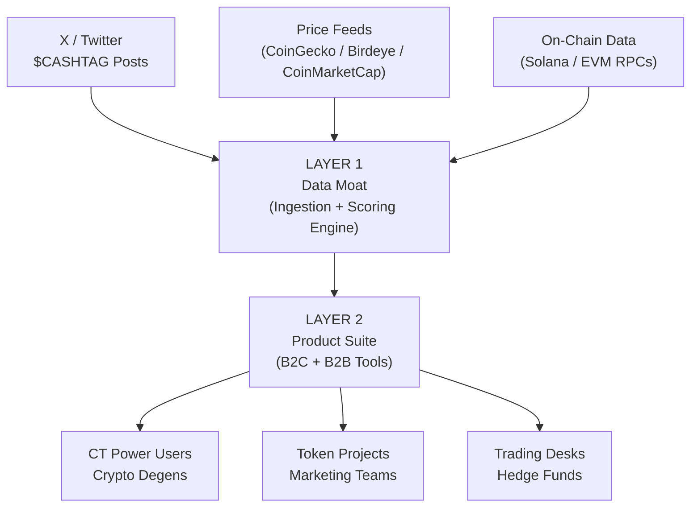
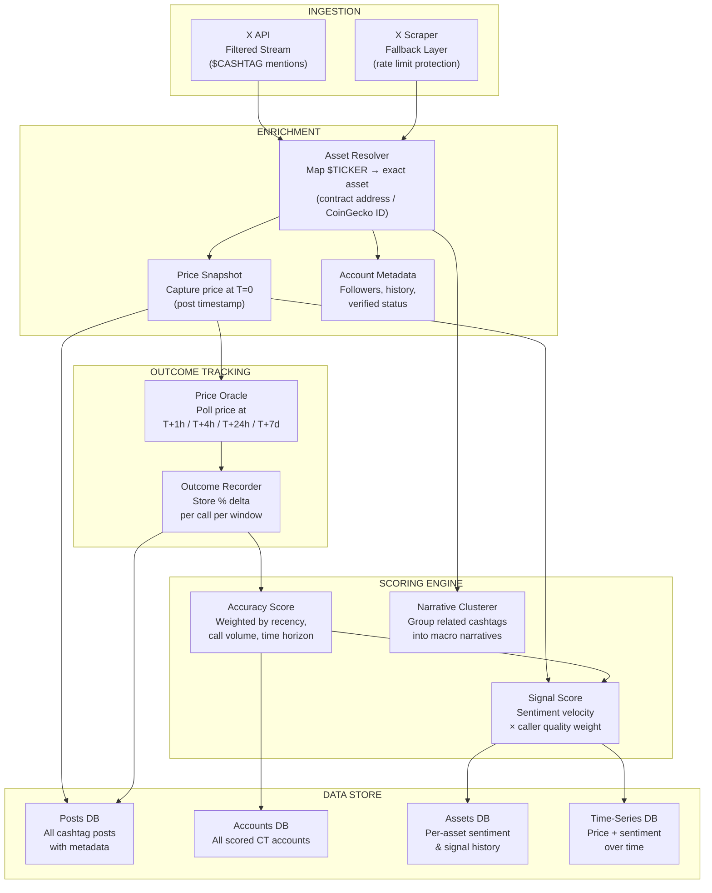
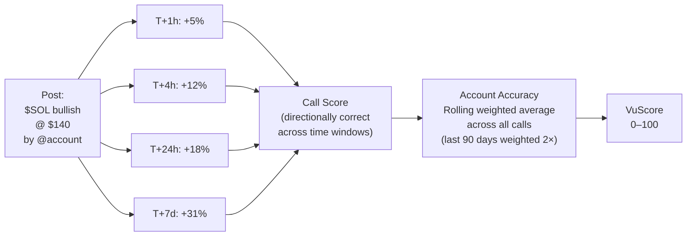
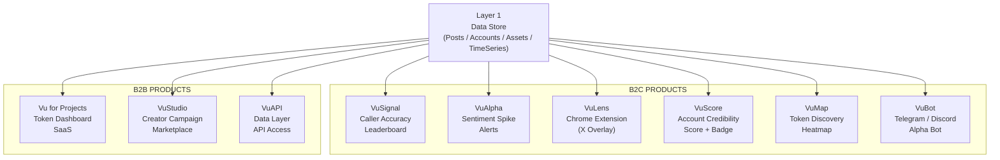
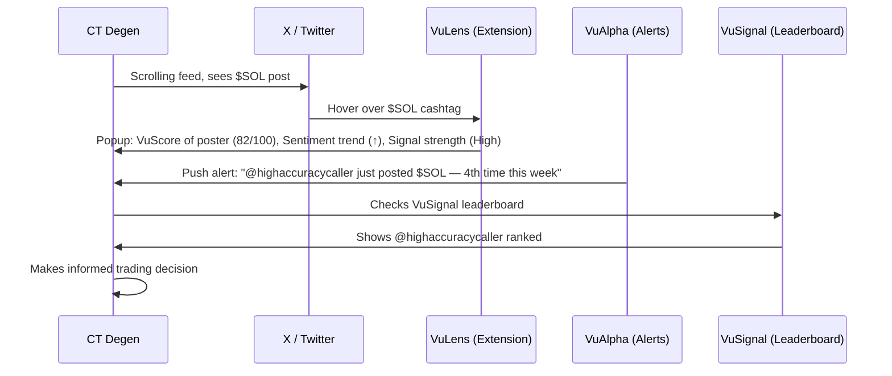
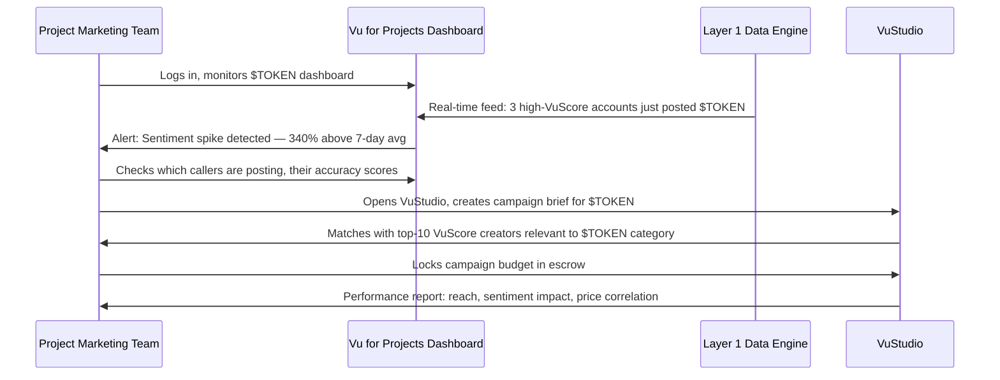
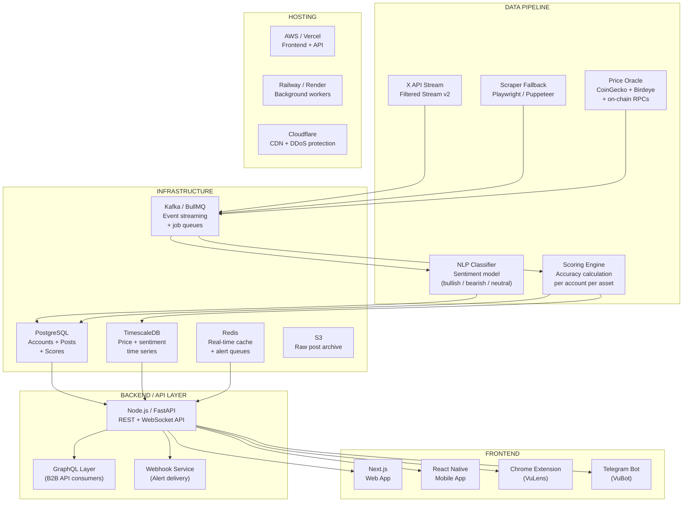
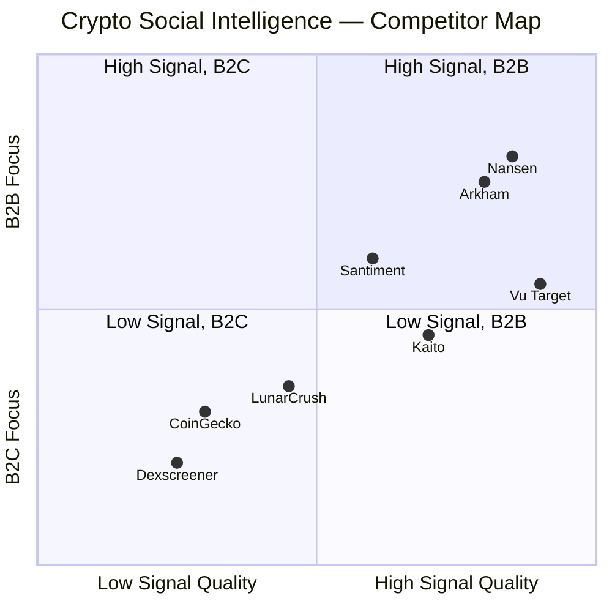
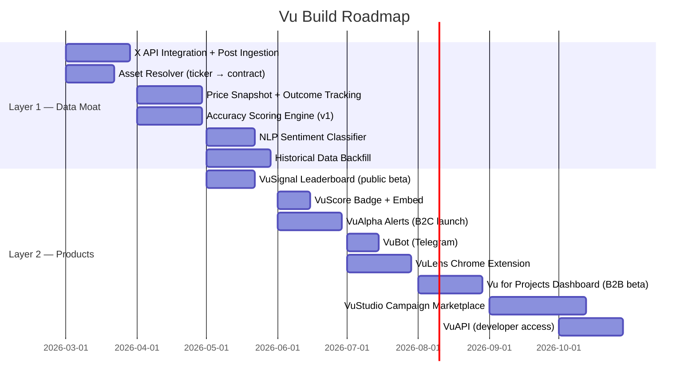

# Vu — Technical Architecture Document

**Version 1.0 | March 2026 | Confidential**

---

## 1. Goal

X's Smart Cashtags — launching imminently — transforms every `$TOKEN` mention on X into a structured, machine-readable, tradeable financial object. For the first time, social posts are directly linked to specific assets, price data, and trading actions at scale across 700M users.

**Vu's mission:** Be the intelligence layer built on top of Smart Cashtags. The first platform to turn CT (Crypto Twitter) cashtag activity into actionable data — and build the B2C and B2B tooling on top of that data moat.

### Strategic Thesis

> X provides the pipe. Vu provides the brain.

Smart Cashtags tell you _what_ is being discussed. Vu tells you _who_ is discussing it, _how accurate_ they've historically been, _what the crowd sentiment means_, and _when to act_.

### Why Now

- X Smart Cashtags launching March 2026 — structural shift in how financial data flows through social media
- Kaito (closest competitor) had its core Yaps product killed by X's API crackdown in January 2026 — displacing thousands of creators and projects
- The InfoFi / CT intelligence space is wide open for a credibility-first, accuracy-scored platform
- First mover on the data layer wins — the historical accuracy dataset compounds and becomes increasingly hard to replicate

---

## 2. Architecture

### Overview

Vu is built in two layers. Layer 1 is the data moat — ingestion, enrichment, and scoring. Layer 2 is the product suite — B2C and B2B tools built on top of Layer 1.

---

### 2.1 Layer 1 — The Data Moat

Layer 1 is the core competitive advantage. It ingests every cashtag mention from X, enriches it with price data at the time of posting, tracks subsequent price outcomes, and produces an accuracy score per account.

#### Key Data Points Captured Per Post

| Field                                              | Source              | Purpose                           |
| -------------------------------------------------- | ------------------- | --------------------------------- |
| Account ID + handle                                | X API               | Link to account accuracy history  |
| `$CASHTAG` + resolved asset                        | X API + CoinGecko   | Identify exact asset being called |
| Post timestamp                                     | X API               | Anchor price snapshot             |
| Price at T=0                                       | CoinGecko / Birdeye | Baseline for outcome tracking     |
| Price at T+1h, T+4h, T+24h, T+7d                   | Price oracle        | Measure call accuracy             |
| Post engagement (likes, RTs, replies)              | X API               | Weight signal quality             |
| Follower count at time of post                     | X API               | Normalise influence               |
| Sentiment classification (bullish/bearish/neutral) | NLP model           | Directional accuracy tracking     |

#### Accuracy Scoring Model

---

### 2.2 Layer 2 — Product Suite

All Layer 2 products consume the Layer 1 data via an internal API. Each product is a different lens on the same dataset.

#### Layer 2 Product Details

| Product             | Type            | Model                                                             | Description                                                                                                                             |
| ------------------- | --------------- | ----------------------------------------------------------------- | --------------------------------------------------------------------------------------------------------------------------------------- |
| **VuSignal**        | B2C + B2B       | Freemium — free top 100, paid full history + filters              | Public leaderboard ranking CT accounts by call accuracy. Free tier drives virality, pro unlocks deeper stats and historical performance |
| **VuAlpha**         | B2C + B2B       | Subscription $30–100/mo; B2B API pricing                          | Real-time alerts when high-VuScore accounts post. Free = 30min delay, Pro = real-time + Telegram + custom watchlists                    |
| **VuLens**          | B2C             | Freemium — 10 hovers/day free, Pro ~$20/mo                        | Chrome extension overlaid on X. Hover any $CASHTAG → see caller score, sentiment trend, signal strength. Zero context switching         |
| **VuScore**         | B2C             | Free to display, Pro for full breakdown + embed badge             | Embeddable credibility score for any CT account. Accounts embed in bio, driving Vu brand awareness                                      |
| **VuMap**           | B2C             | Freemium, Pro for alerts + deeper filters                         | Live visual heatmap of tokens gaining CT attention relative to market cap. Discover tokens early                                        |
| **VuBot**           | B2C             | Free for small groups, paid for large groups or advanced features | Telegram/Discord bot. `/vu $SOL` returns sentiment score, top callers, recent high-signal posts                                         |
| **Vu for Projects** | B2B SaaS        | $500–3,000/mo per project, tiered by token size                   | Real-time cashtag monitoring dashboard for a project's own token — sentiment, caller quality, competitor comparison, influencer alerts  |
| **VuStudio**        | B2B Marketplace | 15–20% take rate on campaign spend                                | CT campaign marketplace. Projects post briefs, verified high-VuScore creators apply, performance-based payouts                          |
| **VuAPI**           | B2B API         | Usage-based + enterprise contracts                                | Raw data API — quality-weighted sentiment, caller scores, asset signal history. Sold to trading bots, funds, analytics platforms        |

---

#### User Flow — B2C (CT Power User)

#### User Flow — B2B (Token Project)

---

## 3. Infrastructure

### 3.1 Architecture Stack

---

### 3.2 Infrastructure Costs

#### Monthly Cost Estimate — MVP (0–6 months)

| Component              | Service                         | Spec                           | Monthly Cost       |
| ---------------------- | ------------------------------- | ------------------------------ | ------------------ |
| **X API Access**       | X Basic/Pro API                 | Filtered stream, 500K posts/mo | $100–500           |
| **Price Feed**         | CoinGecko Pro                   | Real-time + historical         | $129               |
| **On-chain RPC**       | Helius (Solana) + Alchemy (EVM) | 10M requests/mo                | $100–200           |
| **Database**           | Supabase (PostgreSQL)           | 8GB, 2 CPU                     | $25                |
| **Time-series DB**     | Timescale Cloud                 | 10GB, starter                  | $50                |
| **Cache**              | Redis Cloud                     | 1GB                            | $30                |
| **Backend API**        | Railway                         | 2 services, 2GB RAM            | $40                |
| **Frontend**           | Vercel Pro                      | —                              | $20                |
| **Background Workers** | Railway                         | 2 workers                      | $40                |
| **Object Storage**     | AWS S3                          | 50GB archive                   | $5                 |
| **CDN + Security**     | Cloudflare Pro                  | —                              | $20                |
| **NLP Model**          | OpenAI API / self-hosted        | Sentiment classification       | $50–150            |
| **Monitoring**         | Datadog / Sentry                | —                              | $30                |
| **TOTAL MVP**          |                                 |                                | **~$640–1,140/mo** |

---

#### Monthly Cost Estimate — Growth (6–18 months, 10K+ users)

| Component              | Service                     | Spec                        | Monthly Cost         |
| ---------------------- | --------------------------- | --------------------------- | -------------------- |
| **X API Access**       | X Enterprise API            | Full filtered stream        | $5,000+              |
| **Price Feed**         | CoinGecko Enterprise        | Full historical + real-time | $500                 |
| **On-chain RPC**       | Helius + Alchemy Enterprise | 100M requests/mo            | $500–1,000           |
| **Database**           | Supabase Pro / AWS RDS      | 32GB, 4 CPU                 | $200                 |
| **Time-series DB**     | Timescale Cloud             | 100GB                       | $300                 |
| **Cache**              | Redis Enterprise            | 5GB cluster                 | $150                 |
| **Backend API**        | AWS ECS / EC2               | 4 instances, auto-scale     | $400                 |
| **Frontend**           | Vercel Enterprise           | CDN, analytics              | $150                 |
| **Background Workers** | AWS ECS                     | 4 workers, auto-scale       | $300                 |
| **Object Storage**     | AWS S3                      | 500GB archive               | $50                  |
| **CDN + Security**     | Cloudflare Business         | —                           | $200                 |
| **NLP Model**          | Self-hosted (GPU inference) | AWS g4dn.xlarge             | $400                 |
| **Monitoring**         | Datadog                     | Full observability          | $200                 |
| **TOTAL GROWTH**       |                             |                             | **~$8,350–9,850/mo** |

---

#### Key Cost Drivers & Risks

| Risk                    | Detail                                                                | Mitigation                                                                    |
| ----------------------- | --------------------------------------------------------------------- | ----------------------------------------------------------------------------- |
| **X API pricing**       | X may restrict or price-hike API access (killed Kaito)                | Build scraper fallback layer from day 1; diversify data sources               |
| **Price oracle costs**  | High-frequency polling across thousands of assets gets expensive fast | Cache aggressively; only poll assets with active CT mentions                  |
| **NLP at scale**        | Classifying millions of posts/day via OpenAI API gets expensive       | Fine-tune and self-host a small open-source model (e.g. DistilBERT) after MVP |
| **Data storage growth** | Historical post archive grows indefinitely                            | Tier storage: hot (Redis/Postgres) → warm (TimescaleDB) → cold (S3)           |

---

## 4. Competitor Analysis

### Landscape Overview

### Feature-by-Feature Competitor Coverage

Does each competitor support the equivalent of each Vu Layer 2 product?

| Feature                                    | LunarCrush                               | Kaito                                 | Nansen                | Arkham                | Santiment                | CoinGecko                  |
| ------------------------------------------ | ---------------------------------------- | ------------------------------------- | --------------------- | --------------------- | ------------------------ | -------------------------- |
| **VuSignal** — Caller Accuracy Leaderboard | ❌                                       | ⚠️ Yaps (shutdown Jan 2026)           | ❌                    | ❌                    | ❌                       | ❌                         |
| **VuAlpha** — Sentiment Spike Alerts       | ⚠️ Volume only, no caller quality weight | ❌                                    | ⚠️ Wallet alerts only | ⚠️ Wallet alerts only | ⚠️ Social volume alerts  | ❌                         |
| **VuLens** — Chrome Extension / X Overlay  | ❌                                       | ❌                                    | ❌                    | ❌                    | ❌                       | ❌                         |
| **VuScore** — Account Credibility Score    | ❌                                       | ⚠️ Yaps score (shutdown)              | ❌                    | ❌                    | ❌                       | ❌                         |
| **VuMap** — Token Discovery Heatmap        | ⚠️ Social volume heatmap                 | ⚠️ Mindshare map                      | ❌                    | ❌                    | ⚠️ Social volume trends  | ⚠️ Trending page           |
| **VuBot** — Telegram / Discord Bot         | ⚠️ Basic alerts                          | ❌                                    | ⚠️ Smart money alerts | ❌                    | ⚠️ Basic alerts          | ⚠️ Price alerts only       |
| **Vu for Projects** — Token Dashboard B2B  | ⚠️ Basic sentiment dashboard             | ⚠️ Kaito Connect (limited post-pivot) | ❌                    | ❌                    | ⚠️ On-chain metrics only | ✅ Basic listing analytics |
| **VuStudio** — Creator Campaign Platform   | ❌                                       | ✅ Kaito Studio (new, post-Yaps)      | ❌                    | ❌                    | ❌                       | ❌                         |
| **VuAPI** — Data API                       | ✅ Social data API                       | ⚠️ Limited                            | ✅ On-chain API       | ⚠️ Limited            | ✅ On-chain + social API | ✅ Price + market data API |

**Legend:** ✅ Fully supported | ⚠️ Partial / inferior coverage | ❌ Not supported

### Key Competitive Insight

The only competitor that meaningfully overlaps with Vu's core differentiation — **accuracy-scored caller intelligence** — was Kaito's Yaps system. That product was shut down in January 2026 following X's API policy change. **The window is open.**

LunarCrush is the closest surviving competitor on the B2C social sentiment side, but scores only on _volume_, not _quality_. Nansen and Arkham are purely on-chain. Nobody owns the _social signal quality_ layer that Vu is building.

---

## 5. Build Sequence

---

_Document prepared by Darshan | Vu | March 2026_
